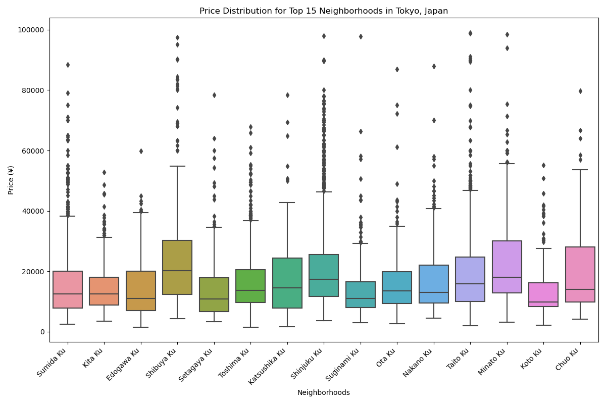

# Listing Activity of Tokyo Airbnbs
With the rise in travel post-pandemic and increased popularity of unique Airbnb accomodations, we explore the best locations and prices for Airbnbs in Tokyo, Japan.

Presented by Abel Dumecha, Amanda Liu, Cassidy Schultheis, and Sophia Emanuel.

## Data Sources
- Found in the 'Resources' directory
  - [Kaggle Dataset: Tokyo Airbnb Open Data 2023](https://www.kaggle.com/datasets/lucamassaron/tokyo-airbnb-open-data-2023?select=reviews.csv)
  - Summary_listings.csv
  - Neighborhoods.geojson

## Data Transforming/Cleaning/Storage
- Deleted unwanted columns
- Split specific columns (e.g., split name column into separate beds and baths columns)
- Removed unwanted symbols and null values
- Modified data types of certain column values and reordered columns
- Uploaded cleaned CSV file as 'updated_summarylist.csv' and imported the data into a SQLite database named 'tokyoAirbnb.sqlite'.
 
 ## Visualizations and Interactivity
 
**We created a Flask App to serve as a welcome page and display our visualizations.**  
  
A bar chart, created with Matplotlib, displays the number of Airbnb listings by neighborhood in Tokyo, Japan.
  

 - This figure was created using the filtered dataframe, containing the top 15 Airbnbs in the Tokyo region. The x-axis shows the neighborhood and the y-axis shows the number of listings. From the visualization of the bar chart, it can be determined that Shinjuku Ku has the most listings. We can also see that the top 5 neighborhoods had greater than 500 listings each, while the remaining neighborhoods have less than 250 listings.  

**Seaborn was used to design the following visualizations:**  

- A histogram was developed to illustrate the overall distribution of Airbnb prices in Tokyo, Japan.  
  

 - The Histogram was created with all of the listings within the dataframe. The x-axis represents the average price in Japanese Yen, and the y-axis represents the numer of listings. From this histogram we can determine that most Airbnbs will cost an average of 20,000 Yen (~ $126.62 USD) or less per night. The increase in the price, the decrease number of listings.

- A box and whisker plot was created to visualize the price distributions of the top 15 neighborhoods with the most listings.  
 

  - The figure was created from a filtered dataframe that contains 15 Airbnbs in Tokyo, Japan with the most listings. The x-axis represents the neighborhoods and the y-axis represents the price of the Airbnb in Japanese Yen. From visualizing the box and whisker plot, it can be determine that most of the neighborhoods have an average price of 20000 Yen (~ $126 USD)or below. It should also be noted that for each neighborhood the upper whisker is much larger than the lower whisker and there are many outliers above the upper limit with no outliers below the lower limit. 

- To analyze the average prices by neighborhood, we created a heatmap showing the top 15 neighborhoods with the most listings and the average price for each room type.  
  

  - This heatmap was made from a filtered dataframe that contains 15 Airbnbs in Tokyo, Japan with the most listings. The x-axis represents the four different room types that can be chosen when selecting an Airbnb and the y-axis lists the neighborhoods. The colored legend provides a reference for the color scale used in the heatmap, representing price in Japanese Yen. Based on the heatmap, it can be concluded as you increase the privacy of an Airbnb (entire home/apt vs. shared room), price will increase. This can be visualized by the darker shades (more expensive Airbnbs) shown on the left side and the colors becoming light (less expensive Airbnbs) as you move across the heatmap. There is one outlier where the price of a shared room in the Edogawa Ku neighborhood where the price of a shared room is above 50000 Yen (~ $316 USD). The price range for an entire home/apt is between 20000 - 30000 Yen (~ $126 - $190 USD) while the price range for a shared room is around 10000 Yen (~ $63 USD) or below and hotel rooms and private rooms falling in between. 

- Another heatmap was designed to display the average prices for all neighborhoods by room type. 
  

  - This heatmap was made from a filtered dataframe that contains the neighborhoods (46) with Airbnb listings in Tokyo, Japan. The x-axis represents the four different room types that can be chosen when selecting an Airbnb and the y-axis lists the neighborhoods. The colored legend provides a reference for the color scale used in the heatmap, representing price in Japanese Yen. Similar to the heatmap representing only the top 15 neighborhoods, as you increase privacy of an Airbnb, the price increases. This is shown by the ligher shades appearing on the left side of the heatmap while the darker shades ( < 20000 Yen (~ $126 USD)) appear on the right side for shared rooms. The appears to be one outlier with a price greater than 120000 Yen (~ $758 USD) in the Okutama Machi neighborhood.

- We created an additional heatmap to show the top 15 neighborhoods with the most listings and the average price based on the number of bedrooms.  
  

- This heatmap was made from a filtered dataframe that contains 15 Airbnbs in Tokyo, Japan with the most listings. The x-axis represents the four different room types that can be chosen when selecting an Airbnb and the y-axis lists the neighborhoods. The colored legend provides a reference for the color scale used in the heatmap, representing price in Japanese Yen. Based on the heatmap, it can be concluded as you increase the number of bedrooms, the price will increase. This can be visualized by the darker shades shown on the left side and the colors becoming light as you move across the heatmap. In the neighborhoods listed, the heatmap shows that all one bedrooms cost 20000 Yen (~ $126 USD) or less. 

**Ploty was used to develop the following visualizations:**  

- We developed a choropleth map to visualize each neighborhood in Tokyo, Japan, color-coded by average price.  
  

  - This map was made from the GeoJSON file we retrieved from our data set. That file stores mostly coordinates that form a multi-polygon that describes each neighborhood, so we wrote a function that flattens out the coordinates if its shape is a multi-polygon. The function checks the "type" in "geometry" in "feature" to conform the shape. The function will also retrieve the name of the associated neighborhood from that file and storing all the them in a "neighborhood_names" list, while the polygons are stored in another list called "polygons". They combined to be a Dataframe with the polygons and their names. Using that Dataframe, we can then create the map using Plotly. We put together the colored map centered around Tokyo with "choropleth_mapbox" from Plotly using the neighborhood names as "featureidkey".

  - In the end, we have a colored map outlining all 46 neighborhoods from our GeoJSON file as seen in the image. On the side, the legends indicates the color for each neighborhood, but when you hover over each area, a pop-up will also say the name of the neighborhood.

- An interactive map was created to display all Airbnb listings, allowing users to filter by room type via a dropdown menu.  
  

  - This map was made with Plotly from the cleaned CSV file of the Airbnb listings in Tokyo. We separated the dataset into four sets by their listed "room_type". Then we combined all the info we want to show of each listing (the name of the listing, the neighborhood that it's in, and the price per night) into one column, and when the user hovers over the property location which was marked by a color dot on the map, they can get some info on a pop-up to determine if the listing is what they are looking for. The legend shows which color means which room type. A clearer view of the properties will show once the user selects the type of property they are looking for.

## GitHub Repository

[Tokyo-Airbnb](https://github.com/sophiagemanuel/Tokyo-Airbnb)
