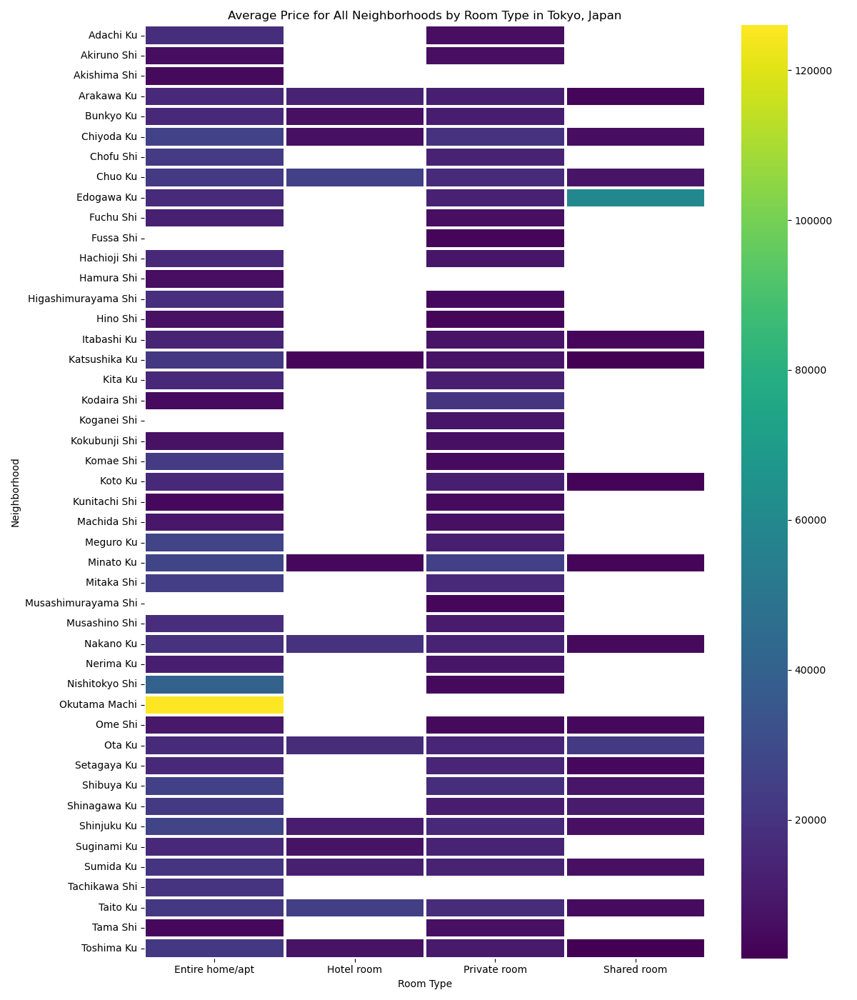

# Listing Activity of Tokyo Airbnbs
With the rise in travel post-pandemic and increased popularity of unique Airbnb accomodations, we explore the best locations and prices for Airbnbs in Tokyo, Japan.

Presented by Abel Dumecha, Amanda Liu, Cassidy Schultheis, and Sophia Emanuel.

## Data Sources
- Found in the 'Resources' directory
  - [Kaggle Dataset: Tokyo Airbnb Open Data 2023](https://www.kaggle.com/datasets/lucamassaron/tokyo-airbnb-open-data-2023?select=reviews.csv)
  - Summary_listings.csv
  - Neighborhoods.geojson

## Data Transforming/Cleaning/Storage
- Deleted unwanted columns
- Split specific columns (e.g., split name column into separate beds and baths columns)
- Removed unwanted symbols and null values
- Modified data types of certain column values and reordered columns
- Uploaded cleaned CSV file as 'updated_summarylist.csv' and imported the data into a SQLite database named 'tokyoAirbnb.sqlite'.
 
 ## Visualizations and Interactivity
 
We created a Flask App to serve as a welcome page and display our visualiations.  
![FlaskAppScreenshot]  
A bar chart, created with Matplotlib, displays the number of Airbnb listings by neighborhood in Tokyo, Japan.
  

Seaborn was used to design the following visualizations:
- A histogram was developed to illustrate the overall distribution of Airbnb prices in Tokyo, Japan.  
  

- A box and whisker plot was created to visualize the price distributions of the top 15 neighborhoods with the most listings.  
 

- To analyze the average prices by neighborhood, we created a heatmap showing the top 15 neighborhoods with the most listings and the average price for each room type.  
  

- Another heatmap was designed to display the average prices for all neighborhoods by room type. 
  

- We created an additional heatmap to show the top 15 neighborhoods with the most listings and the average price based on the number of bedrooms.  
  

Ploty was used to develop the following visualizations:  

- We developed a choropleth map to visualize each neighborhood in Tokyo, Japan, color-coded by average price.  
  

- An interactive map was created to display all Airbnb listings, allowing users to filter by room type via a dropdown menu.  
  

## GitHub Repository

[Tokyo-Airbnb](https://github.com/sophiagemanuel/Tokyo-Airbnb)
